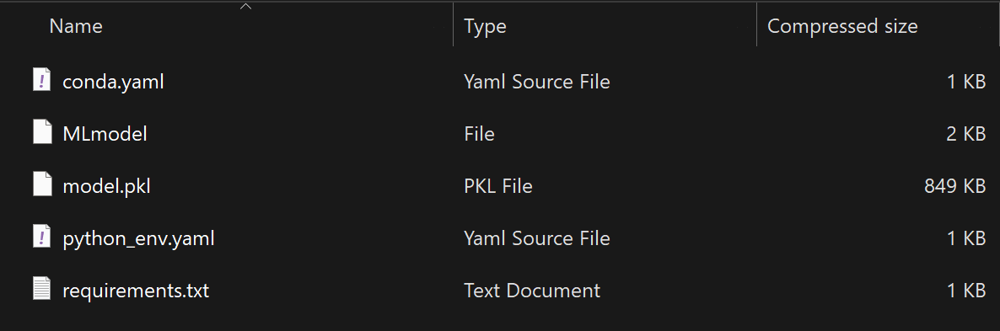
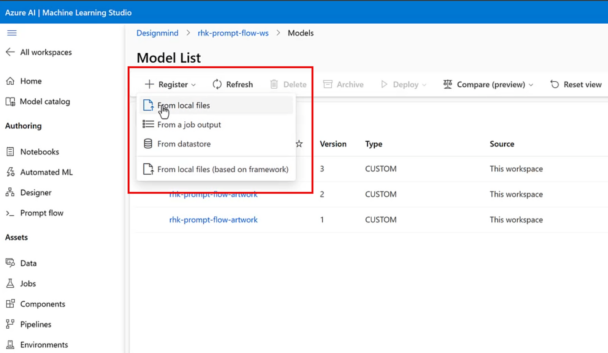
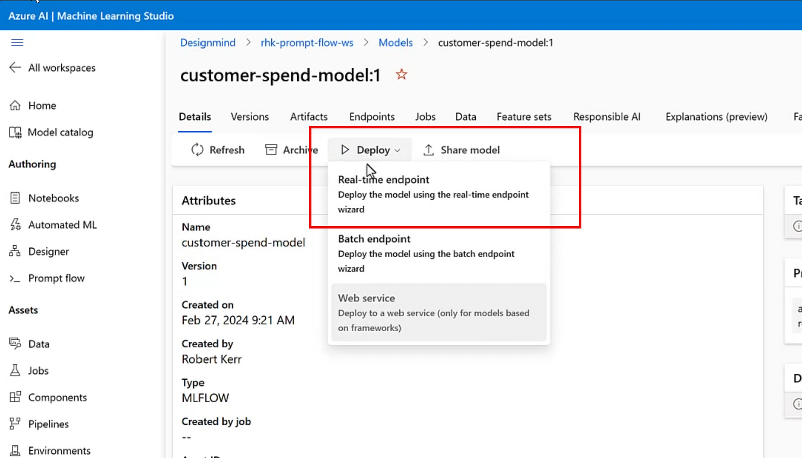
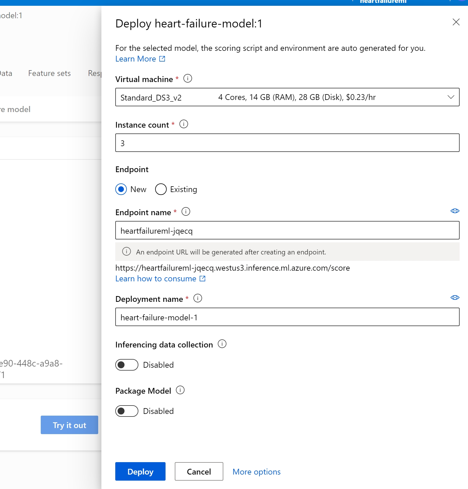
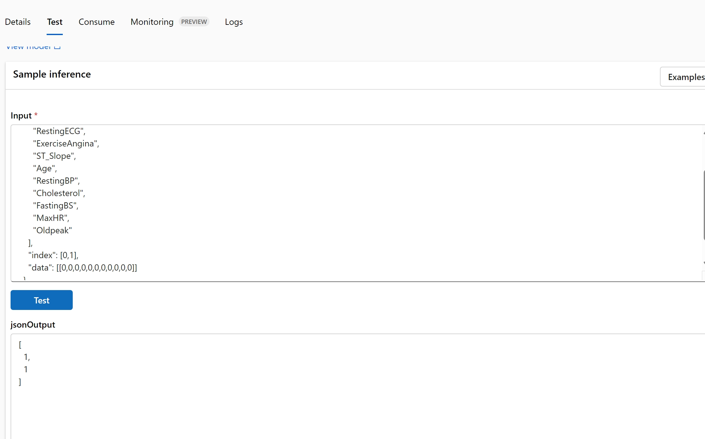
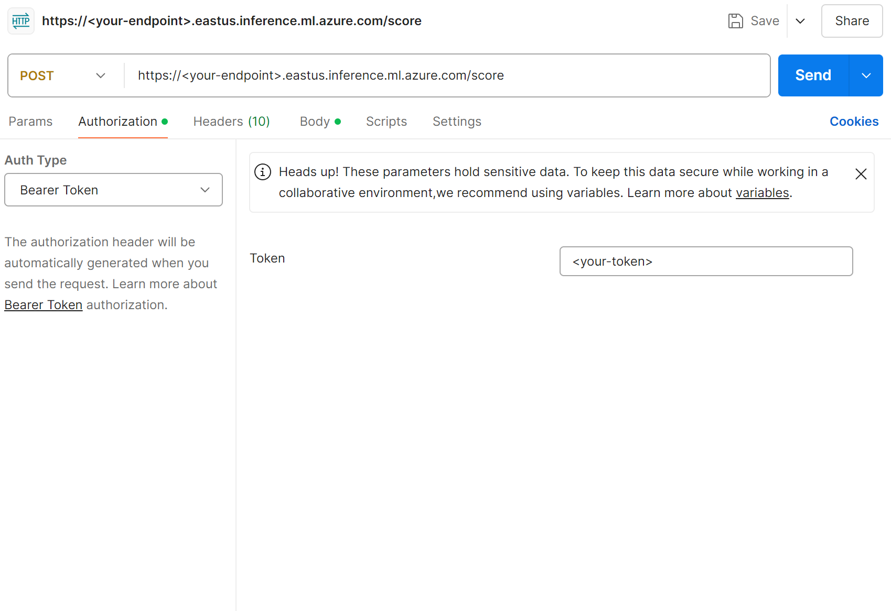
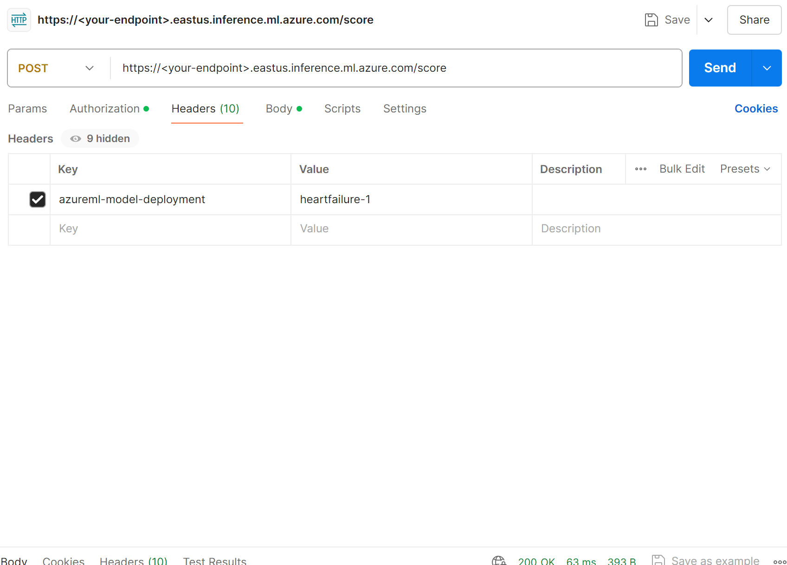
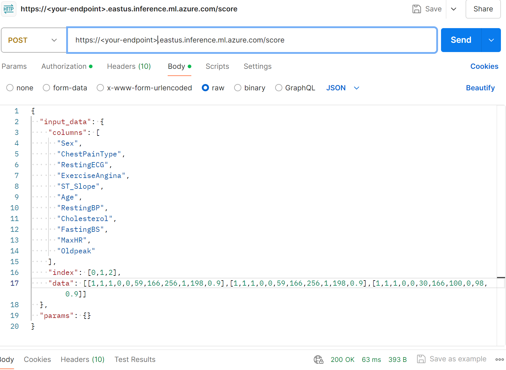

# Importing a Fabric Machine Learning Model to Azure Machine Learning

## Introduction

This article serves as a guide to import a Fabric Machine Learning Model to Azure Machine Learning to be used for real time inferencing with an AML inferencing endpoint. This guide assumes that you have an ML model trained in Fabric and tracked with MLFlow and that you have an Azure Machine Learning Workspace already deployed in Azure. 

## Guide
### Downloading the model files from Fabric
- Within your Fabric tenant, navigate to the corresponding workspace and open the Machine Learning Model Artifact that you want to export to Azure Machine Learning.
- From the following screen, look for the 'Download ML Model Version' button in the toolbar. Fabric will combine the ML Model along with a Python Object Serialization file (a/k/a pickle file) having a `.pkl` extension, and YAML files (.yml) that describe to other platforms the structure and interface provided by the model. All these files are packaged into a .zip file, which will be placed in your Downloads folder.

- If you open the .zip file, you can review the model and metadata files before deploying them to other systems. Make sure you extract the folder before continuing, as you will not be able to upload a .zip file.
  
**NOTE**: due to some compatibility issues with MLFlow and Azure Machine Learning, you will need to modify some files locally before uploading your model to Azure Machine Learning. Once you have downloaded your model from Fabric, unzip the folder and open both the `conda.yaml` and `requirements.txt` files. Change the MLFlow version on both files to `2.7.0`. Save and close both files.
- After downloading the model, we have to deploy an Azure ML real-time inference endpoint to publish the model to the Internet via a RESTful web service.
### Registering the model in Azure Machine Learning
- Navigate to your Azure Portal. Open the Azure Machine Learning workspace you previously deployed.
- Using the left menu in your workspace, navigate to **Assets**>**Models**.
- Register the model in the Azure ML workspace, and use the Azure ML Studio web UI to deploy the endpoint.
- To upload the model, use the **Register**/**From local files** menu in the Model List we navigated to (top left of the screen).
  

- On the upload model wizard, make sure you select MLFlow as your model type and upload the unzipped folder. Give a name and version in the next settings screen.
- After uploading the files, the new model is available in the Models page of the Azure ML Workspace. 
### Deploying the model to a Real-time inferencing endpoint
- Once the model is registered in the Azure ML workspace, click on the model name, and then select Real-time endpoint from the Deploy menu.
  
  
- A menu opens up to configure the compute to use for the endpoint, and to specify the deployment name.
- Specify the compute size desired for the endpoint, and the names for the endpoint and deployment, then tap the Deploy button.
  

- After the deployment completes (10-15 minutes, typically), make a quick "smoke test" within Azure ML Studio to ensure the deployment is functional, and we're using the correct data structures when calling it.
### Testing the deployed model
- The index denotes how many groups of inputs are being sent to receive predictions. If you want to send a single set of inputs, use 0 as index.
- The data is your 11 inputs, in the order that you can see in the columns list. Make sure you send your inputs in a list within the existing list, such as shown in the screenshot below. 
  
- Once the interactive test succeeds, it's time to move on to consume the model from outside the Azure ML environment.
- The consume tab in the endpoint menu shows the endpoint url, keys and headers (in the code example) to make an API call. You can find the Body in the code example, or you can copy it from the test tab. Use POST as your method to get the prediction.
-  To test, you can use postman to send data to deployed model endpoints to test the model. Follow the 3 following screenshots to configure your postman call.
 
 
 

